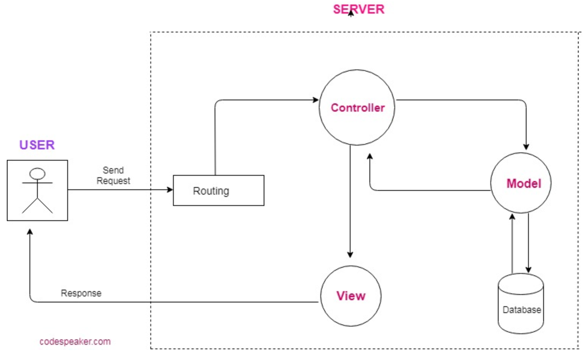

# Reverse-Engineering-Code
## Reverse engineer the starter code provided and create a tutorial for the code.

In the `Develop` folder, there is starter code for a project. Begin inspecting the code to get an understanding of each file's responsibility. Below is a tutorial explaining *every* file and its purpose. For example, how one file is dependant on other files.

## Instroduction :innocent:
Software​ reverse engineering can help to improve the understanding of the underlying source code for the maintenance and improvement of the software, relevant information can be extracted in order to make a decision for software development and graphical representations of the code can provide alternate views regarding the source code, which can help to detect and fix a software bug or vulnerability. Frequently, as some software develops, its design information and improvements are often lost over time, but this lost information can usually be recovered with reverse engineering. This process can also help to cut down the time required to understand the source code, reducing the overall cost of the software development.​ Reverse engineering can also help to detect and eliminate a malicious code written to the software with better code detectors. Reversing a source code can be used to find alternate uses of the source code, such as to detect unauthorized replication of the source code where it wasn't intended to be used, or to reveal how a competitor's product was built. 				

**MODEL**​ is the data layer of our application. It is concerned with the structure of our database and the logic used to retrieve that data. We will implement object-relational mapping to create reusable methods for querying our database​. 
					
**VIEW** ​displays the data, HTML routes and any public files that we send to the client.Everything in the browser side is the VIEW layer in the MVC framework. 
		 	 							
**CONTROLLER**​ is the intermediary between the View and the Model. The Controller handles input from the user, interacts with the Model to create, read, update or delete data, and then returns the results of that query to the user via the VIEW layer.				
			
*FOLDER STRUCTURE*:
					
**CONFIG**
*Middleware > isauthenticated.js*							
-  Config.json							 			
-  Passport.js					
*MODELS*												
-  Index.js									
-  User.js
 											
**NODE MODULES**
`it is a very minimal, extensible model structure for node, it doesn't dictate any DB requirements nor hook into it directly, it's just a plain javascript object with some enhanced capabilities for attributes accessors, validations, tagging and filtering.`
https://www.npmjs.com/package/nodejs-model
 
**PUBLIC**										 								
-  JavaScript						 				
-  login.js							
-  Members.js
-  Signup.js		
-  Stylesheets			
-  Styles.css			
-  HTML
-  Login.html
-  Members.html
-  Signup.html
 								
**ROUTES**
 										
-  Api-routes.js			
-  Html-routes.js
 								
PACKAGE-JSON 
PACKAGE-LOCK.JSON
 											
**SERVER.JS**
						
Config​ stands for configuring settings, where we configure our connection to the database.This folder has some fields which need to be updated.such as PASSWORD and the DATABASE NAME of the database that needs to be queried. After this configuration Sequelize will be able to communicate with the SQL/NOSQL server.
						
Also if we want to add a ​middleware​ to our application it needs to be in the config folder. 
- isauthenticated.js: This middleware is for restricting routes a user is not allowed to visit if not logged in.
						
*We have two other subfolders*
 - Config.json: This is for setting up the password, database and other categories related to sql server connection by updating the fields.				
- Passport.js: Passport is authentication middleware for node.Passport recognises the applications unique authentication requirements.				
Models ​represents all the data of the application. ORM (ObjectRelationalMapper) and the connections are the components of models.ORM interacts directly with Database thus querying the database and subtle all the connections.
						
Model is responsible for handling all the data logic of the application.Models interact with the database and handles all validations saving deleting updating of the data.
				
- INDEX.JS
This folder contains all the connections to several models made for the application. 
 
- USER.JS				
This is the file where our main model that is sequelize data exists. Our main sequel data is created in this folder with help of sequelize.			
						
**PUBLIC**					
This is the View framework of the MVC paradigm.VIEW displays the data, html routes and any public files that we send to the client. VIEW is only responsible for how to present the information that controller sends to views.VIEW interacts with the controller to render the data to the user.
						
**JAVASCRIPT**
 
- LOGIN.JS : This file contains the login information and criterias to be fulfilled for a successful log in. Also it makes the AJAX call to the API route to the server.		
- MEMBERS.JS : This file does a GET request for the members who successfully logged in.
- SIGNUP.JS : This file does a POST route to the signup page of the api through AJAX calls.
						
**STYLESHEET**
- STYLES.CSS: This file applies styling to the form.
						
**HTML**
												
- LOGIN.HTML						 			
- MEMBERS.HTML			
- SIGNUP.HTML
All these files are rendering markdowns for the application and come under the VIEW framework.
 								
**ROUTES**
- API-ROUTES.JS
This is the file where we make request to the APIs for all the routes that we need to have on our application like GET PUT POST DELETE and so on..
						
- HTML-ROUTES.JS				
This is the file where we dynamically generate the markdown for our application by making requests to the servers through API calls.
						
- PACKAGE.JSON					
All npm packages contain a file, usually in the project root, called package.json. This file holds various dependencies relevant to the project. This file is used to give information to the NPM that allows it to identify the project as well as handle the application’s dependencies.
						
- SERVER.JS				
Server.js is the back end to our client/app. In this file we need to provide or list all the dependencies as well as requirements for all the other files and applications that have been used to communicate with the server. This file connects our front end to the back end server. By requiring all the modules and the routes to be listened to at a given port.				
**NPM PACKAGES REQUIRED**								 								
-  EXPRESS			
-  EXPRESS SESSION								
-  MYSQL2									
-  PASSPORT								
-  PASSPORT-LOCAL					 			
-  SEQUELIZE
 								
**INSTRUCTIONS**
 									
1. We can add more models to the application as per the requirements of the application.
2. Instead of using sequelize we can simply use the MySql database for this application.	
3. More features can be added to the application to make it look more tidy such as JSLINT and use of updated syntax of ES6 for the javascripts.